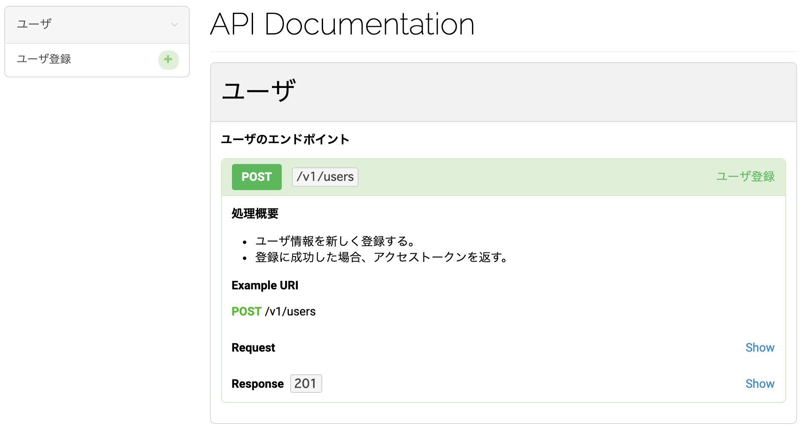
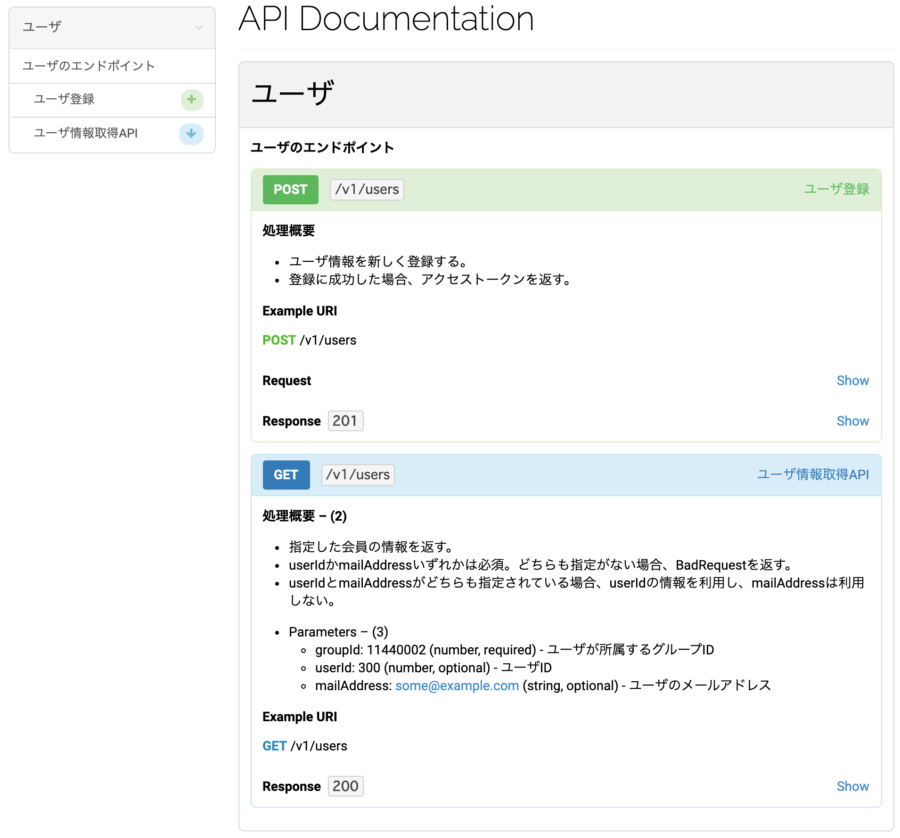
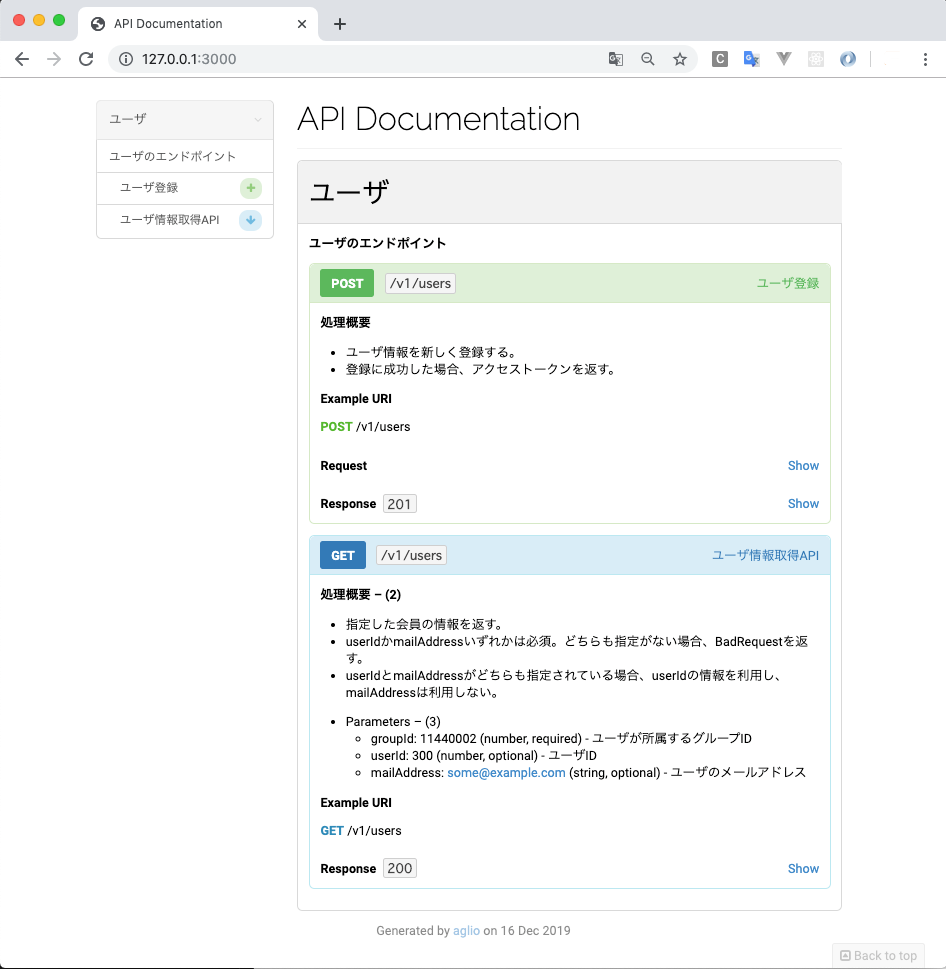
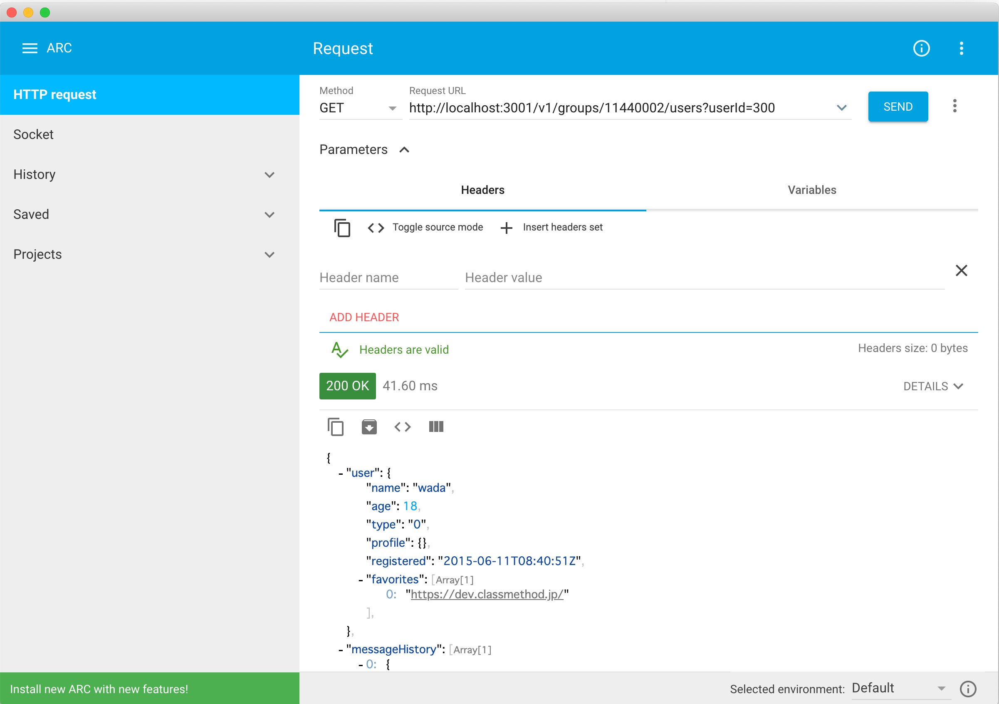

# API Blueprint について

## API Blueprintとは
Markdown形式で書いたAPI仕様から、HTML形式のAPI仕様書を出力するツールです。
さらに、モックサーバを起動することで実際にAPIを実行することも可能です。

## フォルダ構成
```
.
├── README.md  -- このファイル
├── api.md  -- すべてのAPIをまとめたファイル。HTML変換の中間ファイルであるとともに、モックサーバ起動時にも利用します。（自動生成）
├── bin
│     └── converter.sh　-- HTMLへの変換スクリプト
├── output -- 出力用ディレクトリ（自動生成）
│     └── api.html  -- 出力となるHTML（自動生成）
└── src
    ├── api名1.md -- エンドポイントの仕様が記載されたファイル
    ├── api名2.md -- エンドポイントの仕様が記載されたファイル
    ├── ...
```

## 使用方法
### Markdown形式のAPI仕様を記述する手順
`./src/api名.md`にMarkdown形式のAPI仕様を記述します。

#### GETリクエストを受け付けるAPIの記述例

`src/users.md`
```
FORMAT: 1A
 
# Group ユーザ
 
## ユーザのエンドポイント [/v1/users]
 
### ユーザ登録 [POST]
 
#### 処理概要
 
* ユーザ情報を新しく登録する。
* 登録に成功した場合、アクセストークンを返す。
 
+ Request (application/json)
 
    + Headers
 
            Accept: application/json
 
    + Attributes
        + email: test@example.com (string, required) - メールアドレス（format: email）
        + password: abc123 (string, required) - パスワード（pattern: ^[0-9A-Za-z]{6,16}$）
 
+ Response 201 (application/json)
 
    + Attributes
        + accessToken: f58ba22059f5a8aa8f346e0f40987adab326041fac99029c909bef2c6300821a (string, required) - アクセストークン
```

* 第1階層の見出し：リソースグループ情報（上記の例だと「ユーザ」というリソースグループ）
* 第2階層の見出し：エンドポイント情報（APIのURL）
* 第3階層の見出し：HTTPメソッド（GET/POSTなど）

#### GETリクエストを受け付けるAPIの出力例
`src/users.md`をHTML形式のAPI仕様書として出力すると、以下のような見え方になります。（出力方法は後ほど説明）


#### POSTリクエストを受け付けるAPIの記述例

`src/users.md`
```
## ユーザ情報取得 [/v1/groups/{groupId}/users{?userId,mailAddress}] -- (1)
 
### ユーザ情報取得API [GET]
 
#### 処理概要  -- (2)
 
* 指定した会員の情報を返す。
* userIdかmailAddressいずれかは必須。どちらも指定がない場合、BadRequestを返す。
* userIdとmailAddressがどちらも指定されている場合、userIdの情報を利用し、mailAddressは利用しない。
 
+ Parameters  -- (3)
 
    + groupId: 11440002 (number, required) - ユーザが所属するグループID
    + userId: 300 (number, optional) - ユーザID
    + mailAddress: some@example.com (string, optional) - ユーザのメールアドレス
 
+ Response 200 (application/json)
 
    + Attributes
        + user (required)  -- (4)
            + name: wada (string, required) -- (5)
            + age: 18 (number, required) -- (6)
            + type: 0 (enum, required) - ユーザ種別(0:無料ユーザ, 1:有料ユーザ) -- (7)
                + 0 (number)
                + 1 (number)
            + profile (object, required) -- (8)
            + registered: `2015-06-11T08:40:51Z` (string, required)  -- (9)
            + favorites (array) -- (10)
                + `https://dev.classmethod.jp/` (string)
        + messageHistory (array) -- (11)
            + (object)
                + id: 22345 (number, required)
                + title: 今日の献立 (string, required)
```

* (1)エンドポイント - 指定可能なパスパラメータおよびクエリパラメータをブレース{}で囲んで記載します。ここで書いたパラメータは、後のParameters部分でもれなく記載しなければなりません。
* (2)説明 - 第四見出し以降は、API固有の説明として自由に記載できます。
* (3)Parameters - +から書き始めます。次の行以降、インデントを入れてパスパラメータ、リクエストパラメータを記載していきます。parameterName:valueの形式で書きます。valueはサンプル値として扱われます。
* (4)Object - ここからはレスポンスボディの中身です。MSONという形式で記載することで、型の情報や必須かどうかなどのメタ情報を表現することが可能です。MSONで記載すると、サンプルとして記載している値をJSONに変換したものに加え、メタデータも別枠で表記されます。この行は、コロンを記載せずに改行してインデントを入れることで、入れ子になったJSONオブジェクトを表現しています。
* (5)String data - 文字列データです。ダブルクォーテーションは不要です。
* (6)Number data - 数値データです。
* (7)Enum data - 列挙データです。取りうる値をネストして記載すると、メタ情報欄にすべて載せてくれます。APIを利用する開発者からするとcase文にどれだけ分岐を入れればよいのかわかりますから、貴重な情報ですね。
* (8)Object data - 空のオブジェクトを表現したいときは、このように書きます。
* (9)Escape - 文字列の中にエスケープしたい文字が入っている場合は、バッククォートで囲むことで全体をエスケープさせることが可能です。
* (10)Array - 配列データのサンプルです。
* (11)Array Object - 配列データとしてオブジェクトが入っているサンプルです。

#### POSTリクエストを受け付けるAPIの出力例
`src/users.md`をHTML形式のAPI仕様書として出力すると、以下のような見え方になります。（出力方法は後ほど説明）


### HTML形式のAPI仕様書を出力する手順

#### 環境情報
Node.jsとNPMが必要なので、予めインストールしてください。

#### aglioのインストール
NPMでaglioをインストールします。
```
$ npm install -g aglio
```

バージョンを表示し、インストールされていることを確認してください。
```
$ npm aglio -v
6.12.0
```

#### aglioによるプレビュー
コマンドラインからaglioにMarkdownファイルを指定することでプレビューを表示できます。

```
$ aglio -i src/users.md --server
Server started on http://127.0.0.1:3000/
Rendering src/users.md
```

ブラウザで`http://127.0.0.1:3000/`にアクセスして、プレビューを確認してください。


ポート番号が他のサービスと被る場合、`-p ポート番号`でポート番号を指定できます。
```
$ aglio -i src/users.md --server -p 3001
Server started on http://127.0.0.1:3001/
Rendering src/users.md
```

また、npmのスクリプトも登録してあるので`npm run serve`コマンドでもプレビューを実行できます。
```
$ npm run serve [mdファイルの相対パス]
```

#### aglioによるHTMLファイル出力

`bin/converter.sh`を実行することで、`output`配下にすべてのエンドポイントの情報を纏めたHTMLを出力します。

```
$ sh bin/converter.sh
```

HTMLファイル出力の対象となるmdファイルは`bin/converter.sh`のfilesに記述されているので、対象ファイルが増えたらfilesを変更してください。
```
#!/bin/bash
 
cd `dirname $0`
 
files=()
files+=('../src/users.md')
files+=('../src/messages.md')
 
 
echo 'FORMAT: 1A' > ../api.md || exit $?
cat ${files[@]} | sed -e '/^FORMAT: 1A/d' >> ../api.md || exit $?
mkdir -p ../output 2>/dev/null
aglio -i ../api.md -o ../output/api.html || exit $?

open ../output/api.html

exit 0
```

また、npmのスクリプトも登録してあるので`npm run build`コマンドでもHTMLファイル出力を実行できます。
```
$ npm run build
```

### モックサーバを起動する手順
#### 環境情報
Node.jsとNPMが必要なので、予めインストールしてください。

#### drakovのインストール
NPMでdrakovをインストールします。
```
$ npm install -g drakov
```

バージョンを表示し、インストールされていることを確認してください。
```
$ npm drakov -v
6.12.0
```

#### drakovでモックサーバを起動する
コマンドラインでdrakovを以下のオプションで実行することでモックサーバを起動することができます。。
```
$ drakov --watch -p 3002 -f 'src/*.md'
```

また、npmのスクリプトも登録してあるので`npm run mock`コマンドでもモックサーバを起動できます。
```
$ npm run mock
```

ARC等のHTTP Requestツールを使用して、モックサーバがレスポンスを返すことを確認してください。


## 参考情報
[api blueprint（公式ページ）](https://apiblueprint.org/)

[apiaryio/api-blueprint: API Blueprint(GitHub)](https://github.com/apiaryio/api-blueprint)

[【API Blueprintの使い方】Web APIの仕様書を書く・読む・実行する ｜ Developers.IO](https://dev.classmethod.jp/server-side/api-document-with-api-blueprint/)

